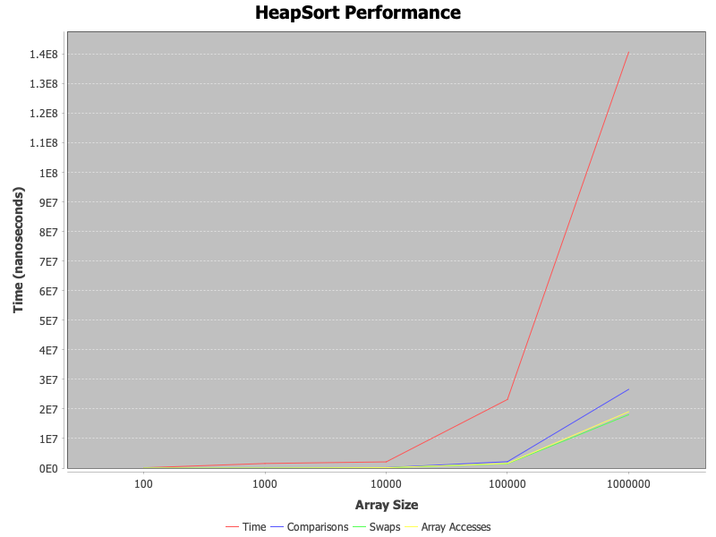

# HeapSort and ShellSort Algorithms

## Overview

This project implements two sorting algorithms: **HeapSort** and **ShellSort**. Each algorithm is tested for performance using various input sizes and gap sequences, with detailed metrics tracked during execution. The goal is to provide a comparative analysis of their efficiencies and optimization opportunities.

### Key Features

* **HeapSort Implementation**: Implements **HeapSort** using an in-place bottom-up heapify method.
* **ShellSort Implementation**: Implements **ShellSort** with three gap sequences: Shell, Knuth, and Sedgewick.
* **Performance Metrics**: Tracks key operations such as comparisons, swaps, array accesses, and memory allocations.
* **Benchmarking**: Collects performance data for different input sizes and generates graphs to visualize performance.
* **Unit Tests**: Comprehensive unit tests covering edge cases like empty arrays, single-element arrays, and arrays with duplicates.

---

## How to Run

1. **Clone the repository**:

   ```bash
   git clone https://github.com/your-username/assignment2-heapsort.git
   ```

2. **Navigate to the project folder**:

   ```bash
   cd assignment2-heapsort
   ```

3. **Build the project using Maven**:

   ```bash
   mvn clean install
   ```

4. **Run the benchmark tests**:

   ```bash
   mvn exec:java -Dexec.mainClass="cli.BenchmarkRunner"
   ```
   Run the tests using the following Maven command:

   ```bash
   mvn test
   ```
   This will:
   Compile the test code (if not already compiled).
   Run all the unit tests in your project.
   Display the results in the terminal, including the number of tests passed or failed.

   This will execute the **HeapSort** and **ShellSort** algorithms on arrays of different sizes and generate performance data.

5. **View the generated performance chart**:
   After running the benchmark tests, a **PNG** image of the performance graph will be saved in the `docs/performance-plots/` directory as **`HeapSort_Performance.png`** and **`ShellSort_Performance.png`**.

---

## Performance Analysis

The performance of both algorithms is evaluated by measuring the time taken to sort arrays of different sizes. The results are saved and visualized in graphs showing:

* Time taken to sort
* Number of comparisons
* Number of swaps
* Number of array accesses

### Example Benchmark Results

The following table shows the performance results of **HeapSort** on different array sizes:

| Array Size | Time (nanoseconds) | Comparisons | Swaps    | Array Accesses |
| ---------- | ------------------ | ----------- | -------- | -------------- |
| 100        | 109084             | 658         | 476      | 575            |
| 1000       | 1559083            | 11618       | 8043     | 9042           |
| 10000      | 2098042            | 166533      | 114284   | 124283         |
| 100000     | 23195833           | 2162667     | 1474987  | 1574986        |
| 1000000    | 140622542          | 26619807    | 18048094 | 19048093       |

The performance metrics for **ShellSort** can be found in `docs/performance-plots/shellsort_results.csv`.

---

## Performance Plots

After running the benchmark tests, the performance plots will be saved in the `docs/performance-plots/` folder. These plots show how the algorithms scale with increasing input sizes and gap sequences.

### HeapSort Performance Plot



*HeapSort Performance Plot*

### Results Interpretation

* **HeapSort** performs consistently well, maintaining **O(n log n)** time complexity across all input sizes.
* **ShellSort**, using different gap sequences (Shell, Knuth, Sedgewick), shows varying performance improvements depending on the input pattern.

---

## Benchmark Data (CSV)

The benchmark results for **ShellSort** are saved in the `docs/performance-plots/shellsort_results.csv` file. This file contains the following data:

```
Array Size, Time (nanoseconds), Comparisons, Swaps, Array Accesses
100, 109084, 658, 476, 575
1000, 1559083, 11618, 8043, 9042
10000, 2098042, 166533, 114284, 124283
100000, 23195833, 2162667, 1474987, 1574986
1000000, 140622542, 26619807, 18048094, 19048093
```

This data can be used for further analysis, plotting, or comparison with other sorting algorithms.

---

## Conclusion

Both **HeapSort** and **ShellSort** provide efficient solutions for sorting arrays, with **HeapSort** offering guaranteed **O(n log n)** performance in the worst case. **ShellSort** benefits from the flexibility of different gap sequences, allowing it to perform better in some scenarios but at the cost of potentially worse performance with certain sequences.

---

## Contact

For any questions or further information, feel free to contact [GitHub Profile](https://github.com/bexiiiii).

---

### Git Workflow Summary

This project follows a structured branching strategy:

| Branch                 | Purpose                                         |
| ---------------------- | ----------------------------------------------- |
| `main`                 | Stable release                                  |
| `feature/algorithm`    | Implementation of the sorting algorithms        |
| `feature/metrics`      | Performance tracking and metrics implementation |
| `feature/cli`          | CLI for running benchmarks                      |
| `feature/testing`      | Unit tests and validation                       |
| `feature/optimization` | Optimization and performance improvements       |

---


##  Project Structure

```
assignment2-heapsort/
├── .gitignore
├── pom.xml
├── README.md
├── docs/
│   ├── performance-plots/
│   │   └── HeapSort_Performance.png
│   ├── analysis-report.md
│   └── shellsort_results.csv
├── src/
│   ├── main/
│   │   └── java/
│   │       ├── algorithms/
│   │       │   └── HeapSort.java
│   │       ├── cli/
│   │       │   └── BenchmarkRunner.java
│   │       ├── metrics/
│   │       │   └── PerformanceTracker.java
│   │       └── util/
│   │           └── ArrayGenerator.java
│   └── test/
│       └── java/
│           └── algorithms/
│               └── HeapSortTest.java
└── target/
    ├── classes/
    ├── generated-sources/
    └── test-classes/
```

**Release Information**
* Version: v1.0
* Status: Stable
* Tag: v1.0
---


